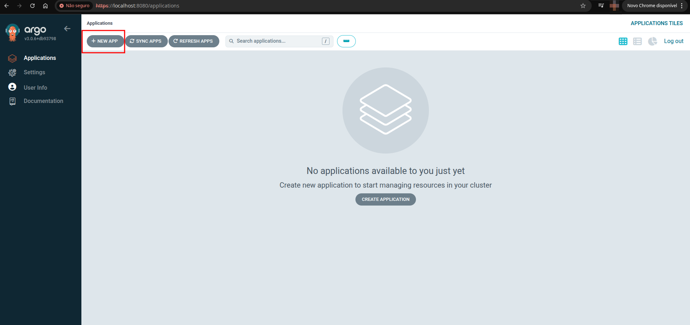

# Projeto: GitOps na Prática com Kubernetes e ArgoCD

Este projeto demonstra a implementação de um fluxo de GitOps para implantar, de forma automatizada, um conjunto de microserviços (**Online Boutique**) num cluster Kubernetes local (`kind`). A gestão do estado desejado da aplicação é feita pelo **ArgoCD**, que utiliza este repositório Git como única fonte da verdade, permitindo que deploys sejam feitos de forma segura e auditável através de um simples `git push`.

-----

## Índice

  * [Descrição do Projeto](https://www.google.com/search?q=%23-descri%C3%A7%C3%A3o-do-projeto)
  * [Tecnologias Utilizadas](https://www.google.com/search?q=%23-tecnologias-utilizadas)
  * [Arquitetura da Solução](https://www.google.com/search?q=%23-arquitetura-da-solu%C3%A7%C3%A3o)
  * [Como Executar o Projeto](https://www.google.com/search?q=%23-como-executar-o-projeto)
  * [Etapas do Projeto](https://www.google.com/search?q=%23-etapas-do-projeto)
  * [Resultados](https://www.google.com/search?q=%23-resultados)
  * [Desafios e Soluções](https://www.google.com/search?q=%23-desafios-e-solu%C3%A7%C3%B5es)
  * [Autor(a)](https://www.google.com/search?q=%23-autora)

-----

## Descrição do Projeto

O objetivo central foi aplicar na prática os conceitos de GitOps, utilizando o Git como fonte única de verdade para a infraestrutura e as aplicações. O projeto consistiu em configurar um ambiente Kubernetes local, instalar e configurar a ferramenta de entrega contínua ArgoCD e, por fim, automatizar o deploy da aplicação de microsserviços "Online Boutique", originalmente da Google.

-----

## Tecnologias Utilizadas

  * **Orquestração de Contentores**: Kubernetes (`kind`)
  * **Motor de Contentorização**: Docker
  * **Controlo de Versão**: Git & GitHub
  * **Ferramenta de GitOps**: ArgoCD
  * **Interface de Linha de Comando**: `kubectl`

-----

## Arquitetura da Solução

O fluxo de trabalho implementado segue o princípio fundamental do GitOps:


Qualquer alteração no manifesto da aplicação que for enviada para a branch `main` deste repositório será automaticamente detetada e aplicada pelo ArgoCD ao cluster local.

-----

## Como Executar o Projeto

### Pré-requisitos

  * Git
  * Docker
  * `kind`
  * `kubectl`
  * ArgoCD CLI (opcional, para gestão de senhas)

### Instruções

1.  **Clone este repositório:**

    ```bash
    git clone https://github.com/oig04/projeto_gitops.git
    cd projeto_gitops
    ```

2.  **Crie o cluster Kubernetes local com `kind`:**

    ```bash
    kind create cluster
    ```

3.  **Instale o ArgoCD no cluster:**

    ```bash
    kubectl create namespace argocd
    kubectl apply -n argocd -f https://raw.githubusercontent.com/argoproj/argo-cd/stable/manifests/install.yaml
    ```

4.  **Aceda ao ArgoCD e crie a aplicação**:

      * Aceda à interface do ArgoCD usando `port-forward` e obtenha a palavra-passe.
      * Crie uma **nova aplicação** na UI apontando para este repositório (`https://github.com/oig04/projeto_gitops.git`) e para o `path: k8s`.

5.  **Aceda à aplicação Online Boutique**:

      * Aguarde a aplicação ser sincronizada e ficar com o estado `Healthy` no ArgoCD.
      * Execute o `port-forward` para aceder ao frontend:
        ```bash
        kubectl port-forward svc/frontend-external 8080:80
        ```
      * Abra o seu navegador em `http://localhost:8080`.

-----

## Etapas do Projeto

1.  **Preparação do Ambiente e Repositório**: O ambiente de desenvolvimento foi configurado com um cluster `kind`. O repositório original da aplicação foi forkado para extrair o manifesto Kubernetes, e este novo repositório (`projeto_gitops`) foi criado para servir como fonte da verdade.

2.  **Otimização do Manifesto Kubernetes**: O manifesto original foi modificado para reduzir os `requests` e `limits` de CPU/memória, garantindo a sua compatibilidade com um cluster local de recursos limitados.

3.  **Instalação e Configuração do ArgoCD**: O ArgoCD foi instalado no cluster. Durante o processo, foi necessário superar desafios de conectividade de rede e redefinir a senha de administrador para garantir o acesso à interface web.

4.  **Criação da Aplicação no ArgoCD**: Uma nova aplicação foi configurada na UI do ArgoCD, estabelecendo o vínculo entre este repositório Git e o namespace `default` do cluster, com uma política de sincronização automática.

5.  **Validação do Fluxo GitOps**: Após a sincronização inicial, foi realizado um teste prático: o número de réplicas do `frontend` foi alterado de 1 para 3 diretamente no ficheiro YAML neste repositório. A alteração foi enviada com `git push`, e o ArgoCD automaticamente aplicou a mudança no cluster, escalando a aplicação como esperado.

-----

## Resultados

A execução do projeto resultou na implementação bem-sucedida de um fluxo GitOps. As imagens abaixo documentam os principais marcos e comprovam o funcionamento da solução.

### 1\. Aplicação Sincronizada no ArgoCD

Após a criação da aplicação na interface do ArgoCD, ela foi automaticamente sincronizada com o estado definido no repositório Git. A imagem abaixo mostra a árvore de recursos, confirmando que todos os manifestos do `online-boutique.yaml` foram aplicados e que a aplicação atingiu o estado **`Healthy`** (Saudável) e **`Synced`** (Sincronizado).

<p align="center"></p>
<p align="center"></p>
<p align="center"></p>
<p align="center"></p>
<p align="center"></p>

### 2\. Frontend da "Online Boutique" Acessível

Com todos os microsserviços a correr no cluster Kubernetes, o frontend da aplicação foi exposto localmente através do comando `kubectl port-forward`. O screenshot abaixo comprova que a loja está online, funcional e pronta para receber tráfego.

<p align="center"></p>


## Desafios e Soluções

Durante o desenvolvimento, alguns desafios foram encontrados e superados:

| Desafio | Descrição do Problema | Solução Aplicada |
| :--- | :--- | :--- |
| **Recursos Insuficientes** | Os pods da aplicação ficavam no estado `Pending` devido a pedidos de CPU e memória (`Insufficient CPU`) que excediam a capacidade do cluster `kind`. | O manifesto `online-boutique.yaml` foi editado para reduzir os valores de `resources.requests` e `resources.limits` da maioria dos microserviços. |
| **`ImagePullBackOff`** | O pod `argocd-dex-server` não conseguia iniciar porque o cluster não conseguia descarregar a sua imagem da internet, resultando em erros de `timeout` e `DeadlineExceeded`. | O problema foi identificado como uma falha de rede no ambiente `kind`/Docker. A solução foi destruir e recriar o cluster com `kind delete cluster` e `kind create cluster`, o que resolveu os problemas de conectividade. |
| **Acesso ao ArgoCD** | A senha inicial do `admin` não funcionou, e o segredo `initial-admin-secret` já tinha sido apagado, impedindo o acesso à UI. | Foi necessário executar o processo de redefinição manual da senha. Isto envolveu o uso da `argocd-cli` para gerar uma nova hash de palavra-passe (`bcrypt`) e aplicá-la diretamente no `argocd-secret` do Kubernetes com `kubectl patch`. |

-----

## Autor(a)

Projeto desenvolvido por **Giovanna**.

  * **GitHub**: [@oig04](https://www.google.com/search?q=https://github.com/oig04)

-----